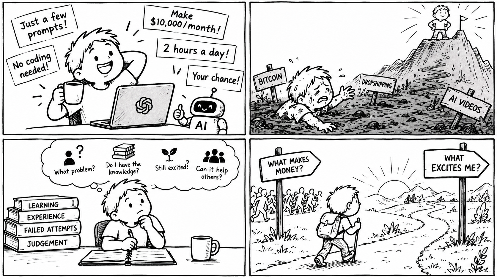

요즘 인터넷에서 자주 보는 문장이다.

'Cursor를 켜고, 프롬프트를 몇 번 입력하고, AI가 코드를 짜는 동안 커피 한 잔 마시면 된다. 코딩을 몰라도 된다. 아이디어만 있으면 된다. 하루 한두 시간이면 된다. 그리고 당연히 돈도 벌 수 있다고 한다.

나는 이런 이야기를 들을 때마다 조금 이상한 생각이 든다. 정말 그렇게 쉽고 확실하게 돈을 벌 수 있다면, 왜 나에게 알려주는 걸까?

세상에 공짜는 없다. 너무 오래된 말이라 이제는 조금 촌스럽게 들리지만, 그만큼 사람의 심리를 정확히 꿰뚫는 말인 것이다.

처음 있는 일도 아니다.
비트코인이 있었다.  
드롭쉬핑이 있었다.  
AI 영상이 있었다.
그때마다 비슷한 문장이 나타났다.

“지금이 기회입니다.”
“아직 아무도 모릅니다.”
“하루 두 시간만 투자하세요.”

그리고 얼마 뒤, 아무도 모른다던 방법을 알려주는 강의가 39만 원에 판매되기 시작한다. 도구만 바뀌었을 뿐이다. 우리는 여전히 적은 노력으로 큰 결과를 얻고 싶어 한다. 남들보다 빨리 알고 싶고, 기회를 놓치고 싶지 않고, 가만히 있다가 뒤처지는 것이 두렵다. 그래서 ‘쉬운 길’이라는 말보다 사실 더 강력한 것은 없다.

AI 시대에는 이것이 더 심해질지도 모른다. 이제 무엇이든 만들 수 있다고 한다.
앱도 만들 수 있고,  
영상도 만들 수 있고,  
책도 쓸 수 있고,  
1인사업도 시작할 수 있다.

문제는 여기서 시작된다. **무엇이든 만들 수 있는 시대에, 무엇을 만들어야 하는가?**
나는 요즘 질문의 순서를 바꾸려고 한다.

**이게 돈이 될까?**

그 질문을 가장 먼저 하지 않으려고 한다.
대신 조금 불편한 질문을 한다.

**나는 어떤 문제를 정말 오래 바라봤는가?**
**남들은 쉽게 지나가지만, 나는 이상하게 계속 마음에 걸리는 문제는 무엇인가?**
**나는 그 문제를 이해할 만큼 지식과 경험이 있는가?**
**아직 부족하다면, 몇 년 동안 공부하고 경험할 마음이 있는가?**
**그리고 언젠가 내 경험과 지식이 나뿐 아니라 다른 사람에게도 실제로 도움이 될 수 있을까?**  

이 질문들은 별로 신나지 않는다. “30일 만에 월 천만 원”보다 클릭도 잘 안 나올 것이다. 하지만 이상하게 나는 이쪽이 더 믿음이 간다.

돈이 되기 전에,  
먼저 가치가 되는 것.

남에게 보여주기 전에,  
먼저 나를 바꾸는 것.

결과가 오지 않아도  
한동안 계속할 수 있는 것.

그 과정 자체에서 조금은 살아 있다는 느낌을 받는 것.

그런 일을 오래 하다 보면 운 좋게 돈이 따라올 수도 있다. 물론 따라오지 않을 수도 있다. 하지만 적어도 완전히 빈손은 아니다. 애초에 내가 느꼈던 문제였고, 내가 필요해서 해결하려고 했던 것이기에 최소한 내 문제는 해결이 된다. 
리고 그동안 쌓인 지식이 남는다.  
판단이 남는다.  
실패한 경험이 남는다.

그리고 다음 무언가를 만들 때  예전의 나는 갖고 있지 않았던 재료가 생긴다.

Elon Musk가 이런 말을 했다.

“과도하게 가져가기보다 더 많이 만들어라.  
사람들에게 유용한 제품과 서비스를 만드는 일을 추구하라.  
돈은 그 결과로 따라온다.  
행복을 직접 추구할 수는 없다.  
행복으로 이어지는 것들을 추구해야 한다.”

Aim to make more than you take.  
Pursue providing useful products and services.  
Money will come as a natural consequence of that.  
You can’t pursue happiness.  
You have to pursue things that lead to happiness.

**무엇을 만들면 돈을 벌 수 있을까?**

그보다 먼저,

**당장 돈이 안 되더라도 나를 설레게하는 것이 무엇이 있을까?**
